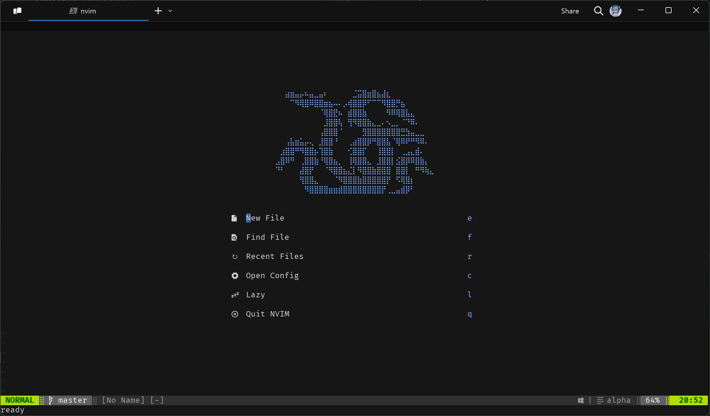
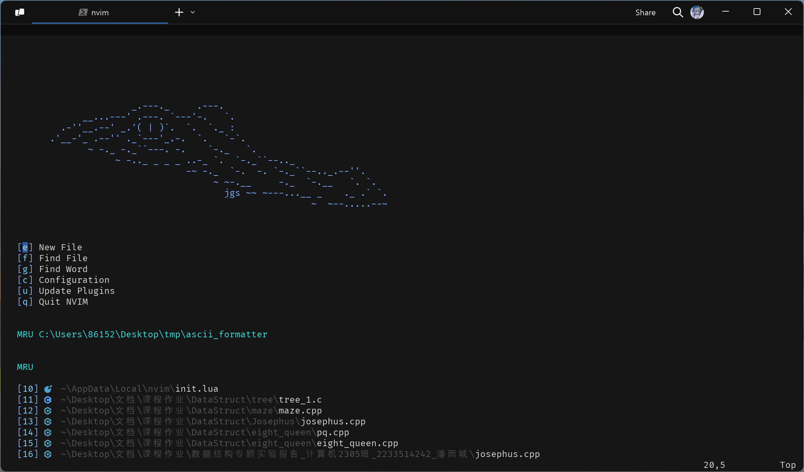
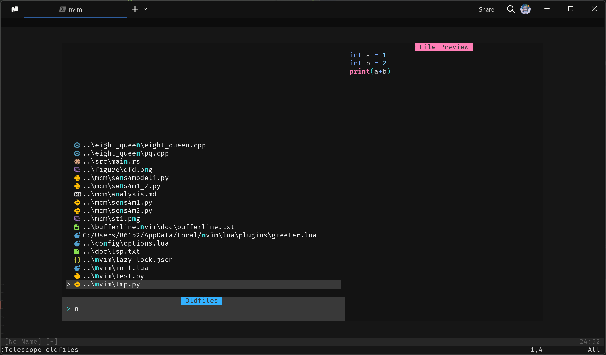
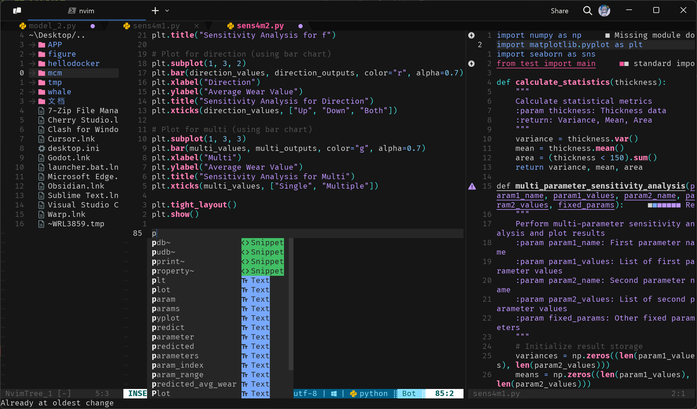

# a self-used neovim config
- theme:  nyoom-engineering/oxocarbon.nvim
- plugin_manager: Lazy.nvim
## Preview
greeter menu(ASCII picture is random from [https://asciiart.website/](https://asciiart.website/))

back theme

using


## Dependence
1. git 
2. neovim
3. ripgrep
4. npm (maybe)
## Install
you can pull it and move it to `.config/nvim` in Linux or `Users\AppData\Local\nvim` which should work after moments

### Steps(maybe right)
#### Linux
```bash
# required
mv ~/.config/nvim{,.bak}

# optional but recommended
mv ~/.local/share/nvim{,.bak}
mv ~/.local/state/nvim{,.bak}
mv ~/.cache/nvim{,.bak}
```
clone repo
```bash
git clone https://github.com/whale4rain/whale.nvim.git ~/.config/nvim
rm -rf ~/.config/nvim/.git
nvim
```
#### Windows
```bash
# required
Move-Item $env:LOCALAPPDATA\nvim $env:LOCALAPPDATA\nvim.bak

# optional but recommended
Move-Item $env:LOCALAPPDATA\nvim-data $env:LOCALAPPDATA\nvim-data.bak

git clone https://github.com/whale4rain/whale.nvim.git $env:LOCALAPPDATA\nvim

Remove-Item $env:LOCALAPPDATA\nvim\.git -Recurse -Force

nvim
```
## All Plugins
```
C:.
|   .gitignore
|   init.lua
|   lazy-lock.json
|   README.md
|
+---lua
|   +---config
|   |       colorscheme.lua
|   |       keymaps.lua
|   |       lazy.lua
|   |       options.lua
|   |
|   \---plugins
|       |   auto-session.lua
|       |   autopairs.lua
|       |   buffer.lua
|       |   comment.lua
|       |   formatting.lua
|       |   greeter_back.lua
|       |   linting.lua
|       |   nvim-cmp.lua
|       |   nvim-navic.lua
|       |   nvim-notify.lua
|       |   nvim-tree.lua
|       |   nvim-treesitter-context.lua
|       |   nvim-treesitter.lua
|       |   status.lua
|       |   surround.lua
|       |   telescope.lua
|       |   todo-comments.lua
|       |   touble.lua
|       |   vim-maximizer.lua
|       |   which-key.lua
|       |
|       +---back
|       |       ascii_art.txt
|       |       greeter.lua
|       |
|       \---lsp
|               lspconfig.lua
|               mason.lua
|
\---README_picture
        image.png
```